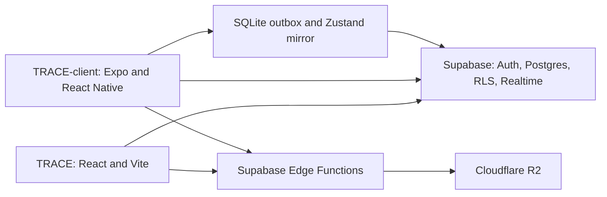

# TRACE architecture

TRACE is a coach-first platform with two independently shipped apps and one Supabase backend.
This document describes the implementation, not a future single-app design.

## Ownership and access

- **TRACE** owns the coach dashboard, public coach pages, onboarding wizard, all canonical SQL migrations and Edge Functions.
- **TRACE-client** (GitHub: `ZO-HN/TRACE-app`) owns trainee screens, local logging and device integrations. A trainee must select a coach before entering the app; coach accounts are blocked.
- Both apps use public Supabase configuration and independent auth sessions. PostgreSQL RLS and narrowly scoped RPCs enforce access. Profile role, platform-admin status and coach linkage cannot be edited through normal profile updates.
- `programs` is the coach-owned catalog. `workout_programs`, `program_days` and `program_enrollments` are trainee-owned personal plans. They are separate models.

## Main flows

1. A coach authors `workout_templates` / `template_items` and assigns a template to a trainee. Mobile downloads real exercise IDs and caches content by account and selection. Explicitly selected missing templates produce an unavailable state, never another workout or demo exercises.
2. Mobile persists session snapshots, set logs and nutrition entries in SQLite before showing success. A single sync worker sends only the signed-in trainee's queue, parents before sets. Session snapshots use `sync_workout_session`; sets and nutrition use UUID upserts.
3. Check-ins include a due date (`scheduled_for`). The server stamps the coach and verifies template ownership; coach-only review fields flow back to the trainee. Form videos upload through R2 presigned URLs and are reviewed through `form_checks`.
4. Steps are daily `wearable_biometrics.step_count` values. Cardio is recorded only in `cardio_entries`; `get_coach_cardio_summary` aggregates these entries. The dashboard refreshes when focused and every 30 seconds while visible. Cardio session count means entry count; legacy cardio-typed strength-session rows are not added again.
5. Program sharing uses `join_program_by_token`. Shared rows are not enumerable by other authenticated users. The RPC validates the token and the source owner's access, then transactionally clones templates/items and days into a private recipient-owned copy. Rest days and repeated template references are preserved.

## Offline behavior

SQLite is the durable source; Zustand is its UI mirror. Startup recovers interrupted deliveries. Online enqueue, authentication, network changes and app resume trigger delivery. Failed requests back off (1, 2, 4, 8 seconds), stopping after five failures until manual retry. A persistent banner displays pending/failed work. Account switches retain each account's queue without sending it under another account's token. Revision checks prevent an older response from acknowledging newer queued data.

Downloaded profiles and workout content are account-scoped. They support offline reopening for a previously signed-in trainee; database permissions are rechecked on delivery. First use of a workout requires a connection. Cardio, check-ins, steps and media upload remain online operations. This is not a background OS service: delivery runs while the app is active. See [offline delivery](specs/offline-sync-outbox.md).

## Schema, types and verification

`supabase/migrations` in TRACE is the only migration source. Client migration drafts are historical; do not apply them separately. The September 2026 reconciliation retains tables/data previously installed from those drafts.

`npm run db:types` replays the canonical migrations in disposable PostgreSQL (PGlite), introspects tables/enums/functions, and generates matching `src/lib/database.types.ts` files in both sibling checkouts. `TRACE_CLIENT_PATH` overrides the client location. These types drive the outbox insert types and cardio RPC return type.

`npm run test:db` executes real SQL/RLS tests using a minimal Supabase auth fixture. `npm run test:contracts` verifies literal table/RPC references in both apps. `npm run db:types:check` detects schema/type drift. PGlite does not emulate GoTrue, PostgREST, Realtime transport, Expo or R2; staging/device QA remains required.

## Deliberately separate or deferred

The coach `trace-brain` Edge Function still returns a placeholder. Mobile AI uses a user-configured provider client; no shared RAG pipeline has been implemented. Native wearable ingestion, video calling, solo-mode expansion and new AI features are outside this reliability milestone.
